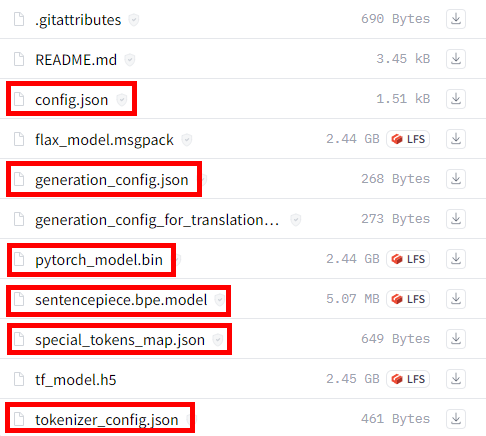
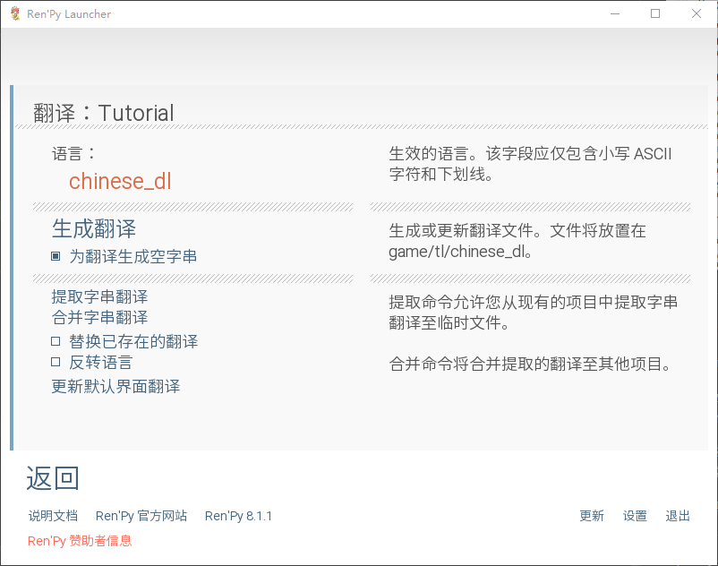

# rpy dl translate

---
*基于深度学习的`.rpy`文件翻译脚本*

*此脚本最初设计用于[**LESSONS IN LOVE**](https://subscribestar.adult/selebus)的中文翻译, 只会针对LIL进行优化*

## 使用的第三方库和模型:

### [DL Translate](https://github.com/xhluca/dl-translate)<br>

### [mBART50](https://huggingface.co/facebook/mbart-large-50-many-to-one-mmt)<br>

---

## 使用教程

---

### step -1: 运行环境

```
pytorch = 2.0.0      #最好是gpu版本
dl_translate = 0.3.0
tqdm = 4.64.1
```

在[mBART50模型文件](https://huggingface.co/facebook/mbart-large-50-many-to-one-mmt/tree/main)里下载指定的6个文件到**一个文件夹**里,并记住**文件夹**的路径



---

### step 0: 生成目标`.rpy`文件

1.下载[renpy-sdk](https://www.renpy.org/latest.html)

2.将游戏文件夹中`game`文件夹下的文件复制到sdk目录下`tutorial/game`文件夹里,如果`game`文件夹下没有`.rpy`文件只有`.rpyc`文件,请自行搜索`.rpyc`转`.rpy`方法

3.然后启动sdk的`renpy.exe`选择`生成翻译`, `语言:`这一栏中填写`chinese_dl` , 勾选 `为翻译生成空字串` 然后点击`生成翻译`



4.生成成功后,`tutorial/game/tl`中会生成带空字符的rpy文件,这些文件将在后面用到

---

### step 1: 建立管理对象

文件夹部分:创建三个文件夹`folder_s`,`folder_t`,`folder_r`, 也可自己命名

* `folder_s` 存放源`.rpy`文件, 旧版本翻译过的文件,用于翻译迁移
* `folder_t` 存放目标`.rpy`文件, step0 生成的文件
* `folder_r` 存放输出`.rpy`文件, 空文件夹, 翻译的结果会放在这里

代码部分: 替换4个`[]`为前文提到的4个**文件夹**的路径

``` python
rm = rpy_translate_manager(r'[]') # 下载的模型所在的文件夹 
rm.set_source_folder(r'[]]')      # folder_s  源rpy文件的文件夹 
rm.set_target_folder(r'[]]')      # folder_t  目标rpy文件的文件夹
rm.set_result_folder(r'[]]')      # folder_r  输出rpy文件的文件夹
```

---

### step 2: 实施操作

所有的操作都是在内存中进行, 不会影响`folder_s`, `folder_t`里的文件

按照自己的需求来运行脚本:

``` python
rm.scan_files()
```

扫描文件夹,必须为第一步

``` python
rm.transfer()
```

迁移翻译, **只会在同名文件间迁移**

``` python
rm.quick_translate()
```

快速翻译, 翻译非翻译的文本

``` python
rm.write_translate_result()
```

保存文件, 保存的文件在`folder_r`文件夹里, 一般为最后一步

``` python
rm.STQW()
```

以上4步骤的一键操作

---

## 注意事项

1. 扫描时只识别台词的文本,其余的均忽略, 所以会输出一些空文本
2. `folder_s`文件夹可以为空, 迁移翻译将失效
3. 翻译速度取决于pytorch是否是gpu版以及你的gpu型号, 作者使用移动版2070-8g, 速度大约为2句每秒
4. 忽视了所有字体格式提示符(粗体,斜体等),以防影响翻译断句

---

### [](https://subscribestar.adult/selebus)<br>