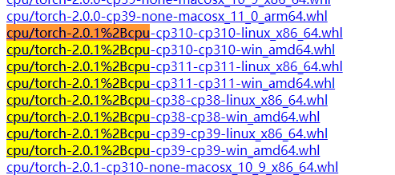
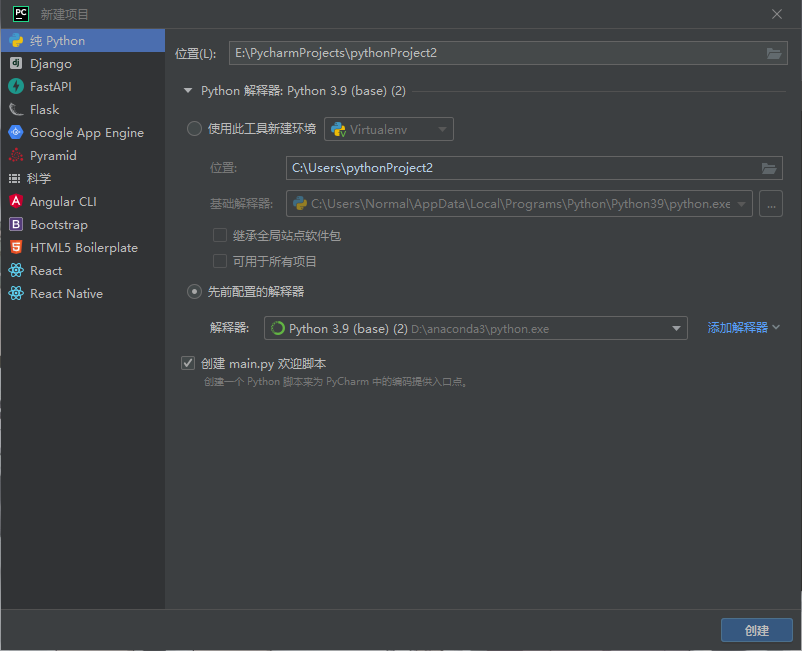
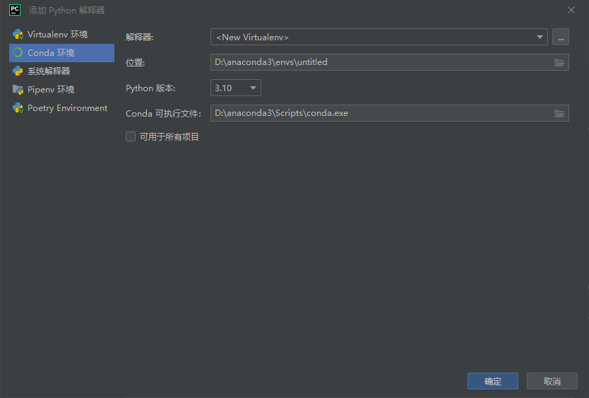
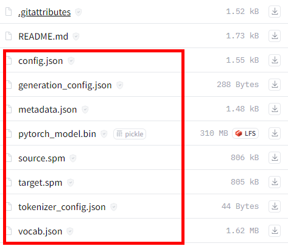
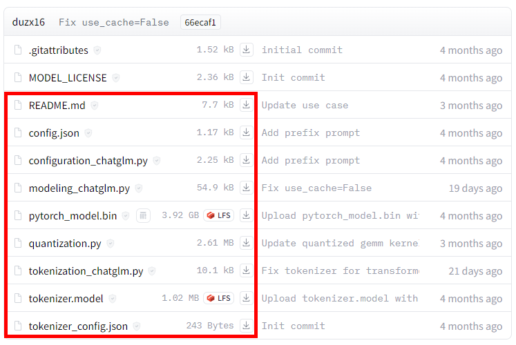
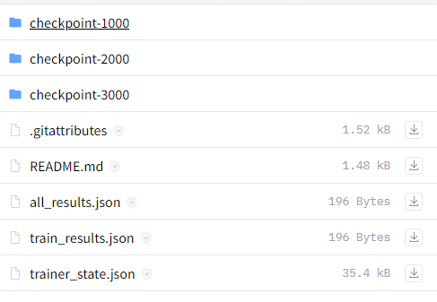
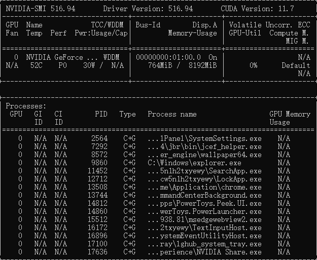
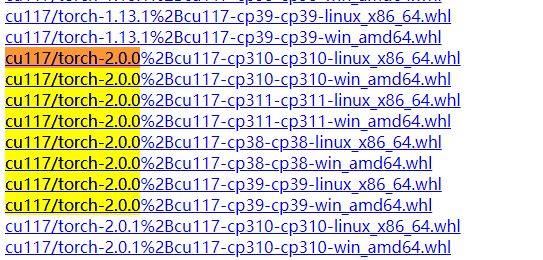
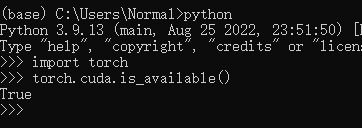

# rpy dl translate

---
*基于深度学习的`.rpy`文件翻译脚本*

*此脚本最初设计用于[**LESSONS IN LOVE**](https://subscribestar.adult/selebus)的中文翻译, 只会针对LIL进行优化*

## 使用的第三方库和模型:

python库:
> [xhluca / dl-translate](https://github.com/xhluca/dl-translate)<br>
> 
> [huggingface / transformers](https://github.com/huggingface/transformers)<br>

模型&权重:
> [mBART50](https://huggingface.co/facebook/mbart-large-50-one-to-many-mmt)<br>
>
> [mBART50_微调](https://huggingface.co/Normal1919/mbart-large-50-one-to-many-lil-fine-tune)<br>
>
> [MarianMT](https://huggingface.co/Helsinki-NLP/opus-mt-zh-en)<br>
>
> [MarianMT_微调](https://huggingface.co/Normal1919/Marian-NMT-en-zh-lil-fine-tune)<br>
>
> [chat_glm2_6b](https://huggingface.co/THUDM/chatglm2-6b-int4)<br>
>
> [chat_glm2_6b_prefix( GPU only )](https://huggingface.co/Normal1919/chatglm2-6b-int4-LIL-prefix)<br>
>
> ps: 微调模型为专为LIL训练的翻译模型

---

## 使用教程

---

### step -1: 环境搭建

有python环境搭建经验的可跳过此步

```
pytorch = 2.0.0      #最好是gpu版本
dl_translate = 0.3.0
tqdm = 4.64.1
```

1. PyCharm, Anaconda 安装

> [PyCharm下载](https://www.jetbrains.com/zh-cn/pycharm/)

> [Anaconda下载](https://www.anaconda.com/download) (不建议安装在C盘)

2. 安装环境

设置镜像源, 在`C:\Users\[用户名]`下找到或创建文件`.condarc`, 以文本的形式打开编辑,替换为一下代码

```
channels:
  - https://mirrors.ustc.edu.cn/anaconda/cloud/menpo/
  - https://mirrors.ustc.edu.cn/anaconda/cloud/bioconda/
  - https://mirrors.ustc.edu.cn/anaconda/cloud/msys2/
  - https://mirrors.ustc.edu.cn/anaconda/cloud/conda-forge/
  - https://mirrors.ustc.edu.cn/anaconda/pkgs/free/
  - https://mirrors.ustc.edu.cn/anaconda/pkgs/main/
  - defaults
show_channel_urls: true
default_channels:
  - https://mirrors.tuna.tsinghua.edu.cn/anaconda/pkgs/main
  - https://mirrors.tuna.tsinghua.edu.cn/anaconda/pkgs/r
  - https://mirrors.tuna.tsinghua.edu.cn/anaconda/pkgs/msys2
custom_channels:
  conda-forge: https://mirrors.tuna.tsinghua.edu.cn/anaconda/cloud
  msys2: https://mirrors.tuna.tsinghua.edu.cn/anaconda/cloud
  bioconda: https://mirrors.tuna.tsinghua.edu.cn/anaconda/cloud
  menpo: https://mirrors.tuna.tsinghua.edu.cn/anaconda/cloud
  pytorch: https://mirrors.tuna.tsinghua.edu.cn/anaconda/cloud
  pytorch-lts: https://mirrors.tuna.tsinghua.edu.cn/anaconda/cloud
  simpleitk: https://mirrors.tuna.tsinghua.edu.cn/anaconda/cloud
report_errors: false
```

---

在`开始`->`所有应用`->`Anaconda3(64bit)`中找到并打开`Anaconda Prompt`

逐行运行以下指令:

```
pip install tqdm
pip install torch
pip install dl_translate
```

> 如果torch下载速度慢,或者卡住, 使用`ctrl+c`强制中断

在[pytorch离线安装文件列表](https://download.pytorch.org/whl/torch_stable.html)中搜索`cpu/torch-2.0.1%2Bcpu`



找到对应`python`版本的`win_amd64`版的安装文件, 下载到电脑上(文件较大)

然后同样打开`Anaconda Prompt`,输入以下指令(替换文件路径)离线安装pytorch

```
pip install [whl文件的绝对路径]
```

安装完三个库后, 在`Anaconda Prompt`运行 `pip list`或`conda list` 检查是否存在`torch`, `tqdm`, `dl-translate` 三个库, 若都存在, 即安装成功

---

3. 创建项目

打开`Pycharm`, 新建项目, 如图将`Python解释器`, `添加解释器`->`添加本地解释器`->`conda环境`, `解释器`项设为`Anaconda`根目录下的`python.exe`,然后点击`创建`





创建好后, 切换到`先前配置的解释器`,选择刚刚创建的conda环境, 再创建项目

打开项目, 下载`example.py`, `rpy_file.py`, `rpy_translate_manager.py`, `translate_string.py`四个文件到项目文件夹下.

---

在[mBART50模型文件](https://huggingface.co/facebook/mbart-large-50-one-to-many-mmt/tree/main)里下载指定的6个文件到**一个文件夹**里,并记住**文件夹**的路径


或者在[MarianMT模型文件](https://huggingface.co/Normal1919/Marian-NMT-en-zh-lil-fine-tune/tree/main)里下载微调模型



或者在[chat_glm2模型文件](https://huggingface.co/facebook/mbart-large-50-one-to-many-mmt/tree/main)中下载主模型

在存放`chat_glm2模型文件`的文件夹中新建名为`prefix`的文件夹并下载[chat_glm2_prefix](https://huggingface.co/Normal1919/chatglm2-6b-int4-LIL-prefix/tree/main)微调权重





以上就完成了运行脚本的准备工作

---

### step 0: 生成目标`.rpy`文件

1.下载 [Renpy-sdk](https://www.renpy.org/latest.html)

2.将游戏文件夹中`game`文件夹下的文件复制到sdk目录下`tutorial/game`文件夹里,如果`game`文件夹下没有`.rpy`文件只有`.rpyc`文件,请自行搜索`.rpyc`转`.rpy`方法

3.然后启动sdk的`renpy.exe`选择`生成翻译`, `语言:`这一栏中填写`chinese_dl` , 勾选 `为翻译生成空字串` 然后点击`生成翻译`


4.生成成功后,`tutorial/game/tl`中会生成带空字符的rpy文件,这些文件将在后面用到

---

### step 1: 建立管理对象

文件夹部分:创建三个文件夹`folder_s`,`folder_t`,`folder_r`, 也可自己命名

* `folder_s` 存放源`.rpy`文件, 旧版本翻译过的文件,用于翻译迁移
* `folder_t` 存放目标`.rpy`文件, step0 生成的文件
* `folder_r` 存放输出`.rpy`文件, 空文件夹, 翻译的结果会放在这里

代码部分:

`rpy_file.py`, `rpy_translate_manager.py`, `translate_string.py` 以及`emample.py`在同一目录下

替换4个`[]`为前文提到的4个**文件夹**的路径

``` python
from rpy_translate_manager import rpy_translate_manager

rm = rpy_translate_manager(model_or_path = r'[]',     # 下载的模型所在的文件夹 
                           replace_json_path = r'[]') # replace.json文件位置 

rm.set_source_folder(r'[]]')      # folder_s  源rpy文件的文件夹 
rm.set_target_folder(r'[]]')      # folder_t  目标rpy文件的文件夹
rm.set_result_folder(r'[]]')      # folder_r  输出rpy文件的文件夹
```

---

### step 2: 实施操作

所有的操作都是在内存中进行, 不会影响`folder_s`, `folder_t`里的文件

按照自己的需求来运行脚本:

``` python
rm = rpy_translate_manager(self, model_or_path: str = '',
    model_family: str = 'mbart50',
    replace_json_path: str = './replace.json',
    device: str = "auto")
```

初始化, 指定模型所在文件夹, 模型名, 替换`json`位置

* `model_or_path`即环境搭建时下载的文件所在的文件夹

* `model_family`为对应模型的名字, 有`mbart50`,`MarianMT`,`chat_glm2`和三个选择

* `replace_json_path`为替换`json`位置

---

``` python
rm.scan_files()
```

扫描文件夹,必须为第一步

---

``` python
rm.transfer()
```

迁移翻译, **只会在同名文件间迁移**

---

``` python
rm.quick_translate(batch=64)
```

快速翻译,翻译非翻译的文本,`batch`指定批量翻译, 默认64, 视显存容量可以增加

---

``` python
rm.translation_fix()
```

通过`replace.json`对AI翻译中的特定词语进行替换


---

``` python
rm.write_translate_result()
```

保存文件, 保存的文件在`folder_r`文件夹里, 一般为最后一步


---

## 进阶

### 1. 使用GPU运行模型

前提:拥有8GB以上显存的英伟达显卡

1. 检查cuda版本

在cmd输入指令```nvidia-smi```, 检查右上角`CUDA`版本



2. 下载安装`whl`库文件

然后打开[pytorch离线安装文件列表](https://download.pytorch.org/whl/torch_stable.html), 网页中`ctrl+F` ,搜索`cuXXX/torch-2.0.0`

其中`XXX`是刚才的cuda版本号去除小数点, 比如图中11.7, 那就搜索`cu117/torch-2.0.0`, 如图



找到对应`python`版本的win_amd64版的安装文件, 下载到电脑上(文件较大)

然后同样打开`Anaconda Prompt`,输入以下指令(替换文件路径)离线安装pytorch

3. 检查是否安装成功

使用

打开`Anaconda Prompt`, **依次**执行以下指令, 并查看输出

若输出`True`, 则代表cuda版安装成功, 案例如图

安装成功后, 脚本会自动切换到cuda运行

```cmd
python
import torch
torch.cuda.is_available()
```



---

### 2. replace.json修正翻译

`rm.translation_fix()`会根据`replace.json`替换翻译

`replace.json`文件格式: (举例其中一部分)

```json
{
  "keep_translate": {
    "Ayane": [
      "艾安",
      "艾安娜",
      "艾安妮",
      "阿安"
    ]
  },
  "key": [
    "[noriko_love]",
    "[makoto_lust]"
  ],
  "replace_translate": {
    "Character": {
      "角色": [
        "特征",
        "字符"
      ]
    },
    "Dorm Wars": {
      "宿舍大战": [
        "宿舍战争",
        "多姆大战"
      ]
    }
  }
}
```

`"keep_translate"`为保持翻译的规则:

> `"Ayane"`, 代表原文出现了`Ayane`, 但是翻译错了, 希望将翻译错的词还原为`Ayane`
>
>`["艾安","艾安娜","艾安妮","阿安"]`, 代表`Ayane`可能翻译成的四种结果, 希望将这些词替换为`Ayane`
>
>所以, 原句中有`Ayane`的, AI翻译中有`艾安`的, `艾安`将会被替换为`Ayane`

`"key"`翻译缺失的检查:

> 要求原文出现并且译文也出现的单词, 尤其各种renpy使用的替换标志,比如`[noriko_love]`
>
> 检测到缺失后会添加`@@键缺失@@`标志

`"replace_translate"`为替换翻译的规则:

> 比如`Dorm Wars`会翻译成 `宿舍战争` 或 `多姆大战` 但需要翻译为 `宿舍大战`
>
> 检测到后会替换为 `宿舍大战`, 此规则可用于规范常见翻译

想自行添加替换, 请按照上文指示, 并符合`.json`文件格式标准

---

### 3. 人工后期润色

为了方便人工后期润色和排错,在翻译文本中添加了两种标志

在文本中使用`ctrl+F`搜索标志

1. 翻译来源标志

> `type:DL_translation`: 标记此翻译为ai翻译
>
>`type:Human_translation`: 标记此翻译为人工翻译
>
> 在人工润色后, 请手动改写翻译来源标记

2. 翻译错误标志

> `@@过长重复@@` 标记可能的连续重复内容
>
> `@@键缺失@@` 标记用于renpy使用的替换标志的缺失 例如 `[noriko_love]`
>
> 会添加到译文的前面

## 注意事项

1. 扫描时只识别台词与strings的文本,其余的均忽略, 所以会输出一些空文本
2. `folder_s`文件夹可以为空, 迁移翻译将失效
3. 翻译速度取决于pytorch是否是gpu版以及你的gpu型号, 作者使用移动版2070-mobile-8g
4. chat_glm翻译不具有稳定性
5. chat_glm微调版本只能在gpu环境下运行

---

### [](https://subscribestar.adult/selebus)<br>